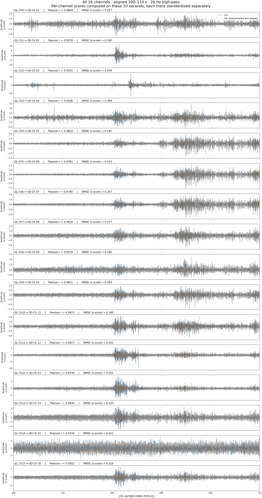

# XF2 decoder with XDF and EDF export

[`decode_xf2.py`](decode_xf2.py) decodes the observed XtrodES XF2 layout into XDF or EDF+, preserving raw ADC counts and original packet timing. A reproducible LSL-versus-SD comparison in [`validation/`](validation/README.md) shows how decoded output agrees with a simultaneous LSL recording.

## Repository layout

| Path | Purpose |
| --- | --- |
| [`decode_xf2.py`](decode_xf2.py) | **The decoder** — command-line tool and importable Python module |
| [`examples/quickstart.py`](examples/quickstart.py) | Runnable end-to-end example: decode, export, and reload XDF/EDF |
| [`validation/`](validation/README.md) | LSL-versus-decoded-SD comparison: scripts, bundled data excerpts, and results |
| [`validation/results/exg/`](validation/results/exg/) | EXG (16-channel) comparison figures, metrics, and spectra |
| [`validation/results/imu/`](validation/results/imu/) | IMU (6-axis) comparison figures, metrics, and spectra |
| [`tests/`](tests/) | Unit tests for the decoder and spectral analysis |

## Install

Python 3.9 or later:

```sh
python3 -m venv .venv
.venv/bin/pip install -r requirements.txt
```

## Quick start

Try the decoder without any recordings. The example builds a small synthetic XF2 file, decodes it, exports XDF and EDF+, and reads both back:

```sh
.venv/bin/python examples/quickstart.py
.venv/bin/python examples/quickstart.py "/path/to/recording.xf2"   # or use your own file
```

Outputs go to `examples/output/`. The script also shows how to call the decoder from Python:

```python
from pathlib import Path
import decode_xf2

streams, report = decode_xf2.decode(Path('recording.xf2'))
exg = next(s for s in streams if s['name'] == 'EXG')
exg['values']   # samples x channels, raw counts (int32)
exg['stamps']   # fitted device Unix timestamps per sample
exg['labels']   # channel labels
```

`decode()` returns an `EXG` and/or `IMU` signal stream and a matching `*_packet_timing` stream for each (columns: packet index, first sample index, sample count). The `report` contains the source hash, packet continuity, and clock-fit statistics.

## Decode XF2 recordings

Pass a folder containing `.xf2` files:

```sh
.venv/bin/python decode_xf2.py "/path/to/recordings"
```

The decoder processes every `.xf2` file directly in that folder and writes into its `decoded/` subfolder:

- One `.xdf` per source file, containing available EXG/IMU signals and corresponding packet-timing streams.
- Per-stream PNG trace plots in raw counts.
- `conversion_report.json` with source hashes, packet continuity, clock-fit statistics, and XDF round-trip verification.
- `README.txt` describing the export.

Each exported XDF is reloaded with `pyxdf`; sample values and timestamps are checked for exact equality against the decoded arrays. The decoder checks observed frame boundaries, payload sizes, and packet continuity. It rejects missing packets rather than silently filling gaps. It supports the observed format and constant stream configuration; it is not a general specification of all XF2 variants. CRC bytes are present but their algorithm is unverified. Physical calibration is not established, and device timestamps are not synchronized to LSL host time.

Pass a single file instead of a folder, and select EDF or both formats:

```sh
.venv/bin/python decode_xf2.py "/path/to/recording.xf2" --format edf
.venv/bin/python decode_xf2.py "/path/to/recordings" --format both --output-dir "/path/to/exports"
```

XDF remains the default. A single-file input writes to `decoded/` beside that file unless `--output-dir` is supplied. Folder input is nonrecursive and accepts case-insensitive `.xf2` extensions. Invalid paths and folders without XF2 files produce an error.

EDF export creates `<stem>_EXG.edf` and/or `<stem>_IMU.edf`, one EDF+ file per available signal stream, so separate start times and lengths are retained. EDF uses each stream's **nominal integer sample rate**, not its fitted clock. Physical values are uncalibrated raw counts: unsigned EXG counts are stored with a digital offset of -32768 and mapped back through the EDF physical range; IMU counts remain signed. Every exported channel is reloaded to verify digital samples, physical count scaling, and sample rate.

EDF requires complete records: the last one-second record is padded with raw zero counts and annotated. `conversion_report.json` records original sample counts and padding. `<stem>_edf_timing.npz` preserves exact fitted timestamps (`EXG_timestamps`, `IMU_timestamps`) and packet timing arrays (`EXG_packet_timing_timestamps`, `EXG_packet_timing_values`, and IMU equivalents). Packet value columns are packet index, first sample index, and sample count. Keep these sidecars and the report with the EDF files. EDF start dates interpret device Unix seconds as UTC; this does not imply clock synchronization. EDF export requires integer nominal rates. This tool reads XF2 input; it does not reconstruct XF2 from EDF.

Existing files with matching output names are overwritten. Run with normal Python, without `-O`, so the XF2 and XDF assertion checks remain enabled.

No full XF2 recordings are bundled. Supply your own folder for decoding; the quick-start example and the validation run entirely from synthetic data or the included cropped samples.

## Validation: LSL versus decoded SD

A comparison of 16 EXG channels and 6 IMU axes against a simultaneous LSL recording over 10 seconds, with per-channel metrics, residuals, and spectral analysis. See [validation/README.md](validation/README.md) for the method, results, and interpretation.



Reproduce all results from the bundled excerpts:

```sh
.venv/bin/python validation/compare_exg.py
.venv/bin/python validation/compare_imu.py
.venv/bin/python validation/spectral_analysis.py
```

## Tests

```sh
PYTHONPATH=. .venv/bin/python -m unittest discover -s tests
```
